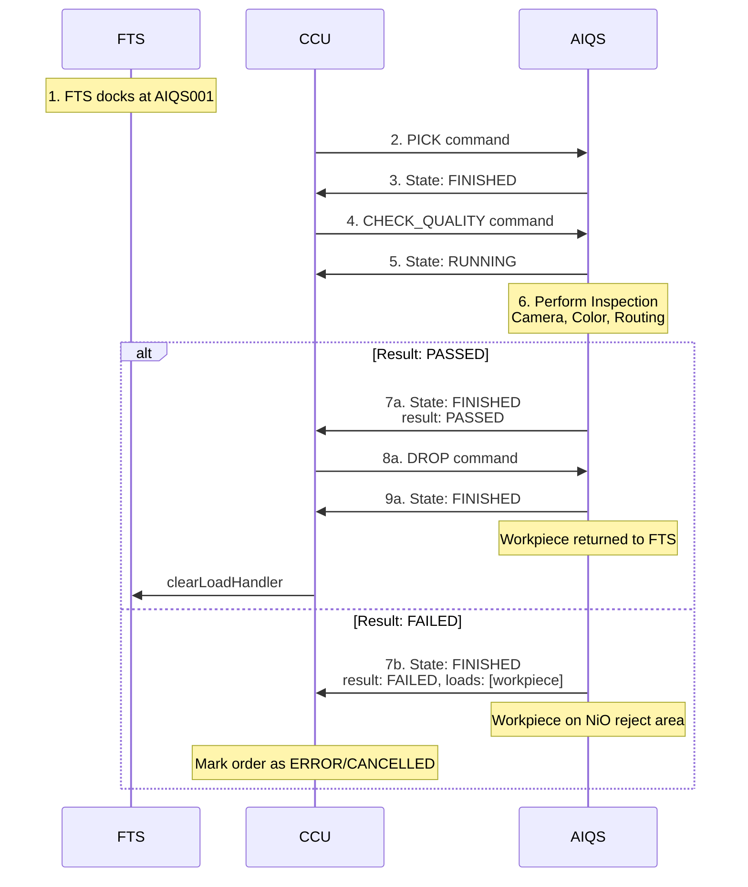

# 6.5 Quality Control with AI (AIQS)

## Overview

The AIQS (Quality Control with AI) module performs automated quality inspection using a camera and color sensor. It checks workpiece color and quality, then routes workpieces based on the result.

**Module Type**: `AIQS`  
**Serial Number**: Cleaned variant of the SPS serial number

## Supported Commands

| Command | Purpose | Result Values | Duration |
|---------|---------|---------------|----------|
| `PICK` | Pick workpiece from AGV | N/A | ~3 seconds |
| `CHECK_QUALITY` | Inspect workpiece quality and color | `PASSED`, `FAILED` | ~3 seconds (fixed) |
| `DROP` | Return workpiece to AGV | N/A | ~3 seconds |

## MQTT Topics

Standard module topics:
- Subscribe: `module/v1/ff/<serial>/order`, `module/v1/ff/<serial>/instantAction`
- Publish: `module/v1/ff/<serial>/state`, `module/v1/ff/<serial>/connection`, `module/v1/ff/<serial>/factsheet`

## Command Example: CHECK_QUALITY

**Command**:
```json
{
  "timestamp": "2024-12-08T12:00:00.000Z",
  "serialNumber": "AIQS001",
  "orderId": "order-check-456",
  "orderUpdateId": 1,
  "action": {
    "id": "check-action-789",
    "command": "CHECK_QUALITY"
  }
}
```

**State Response** (Running):
```json
{
  "headerId": 51,
  "timestamp": "2024-12-08T12:00:01.000Z",
  "serialNumber": "AIQS001",
  "type": "AIQS",
  "orderId": "order-check-456",
  "orderUpdateId": 1,
  "paused": false,
  "actionState": {
    "id": "check-action-789",
    "timestamp": "2024-12-08T12:00:01.000Z",
    "state": "RUNNING",
    "command": "CHECK_QUALITY"
  },
  "errors": [],
  "loads": []
}
```

### Result: PASSED

Workpiece passed inspection and is returned to FTS:

```json
{
  "headerId": 52,
  "timestamp": "2024-12-08T12:00:04.000Z",
  "serialNumber": "AIQS001",
  "type": "AIQS",
  "orderId": "order-check-456",
  "orderUpdateId": 1,
  "paused": false,
  "actionState": {
    "id": "check-action-789",
    "timestamp": "2024-12-08T12:00:04.000Z",
    "state": "FINISHED",
    "command": "CHECK_QUALITY",
    "result": "PASSED"
  },
  "errors": [],
  "loads": []
}
```

### Result: FAILED

Workpiece failed inspection and is routed to NiO (Not in Order) chute:

```json
{
  "headerId": 52,
  "timestamp": "2024-12-08T12:00:04.000Z",
  "serialNumber": "AIQS001",
  "type": "AIQS",
  "orderId": "order-check-456",
  "orderUpdateId": 1,
  "paused": false,
  "actionState": {
    "id": "check-action-789",
    "timestamp": "2024-12-08T12:00:04.000Z",
    "state": "FINISHED",
    "command": "CHECK_QUALITY",
    "result": "FAILED"
  },
  "errors": [],
  "loads": [
    {
      "loadType": "WHITE",
      "loadPosition": "MODULE"
    }
  ]
}
```

When result is `FAILED`, the workpiece remains on the module's reject conveyor (NiO). The process ends here for this workpiece.

## Quality Check Process

1. **Pickup**: Module picks workpiece from FTS (via PICK command)
2. **Camera Inspection**: Checks for physical defects
3. **Color Detection**: Verifies correct color
4. **Routing**:
   - **PASSED**: Returns to FTS via main conveyor
   - **FAILED**: Routes to NiO chute (reject area)

## Hardware Details

### PLC I/O
**Inputs**: Light barriers, suction sensors, camera sensor, color sensor, encoder  
**Outputs**: Conveyor (bidirectional, PWM), suction actuator, compressor, camera lighting

## Errors

- `CHECK_QUALITY_ERROR` - Inspection failed (sensor fault)
- `PICK_ERROR` - Failed to retrieve rejected workpiece

## Special Considerations

**Result Handling**:
- **PASSED**: Workpiece is ready to be dropped back to FTS (send DROP command).
- **FAILED**: Workpiece is routed to NiO chute. The AGV is not used again for this order.

## Complete Quality Check Flow


